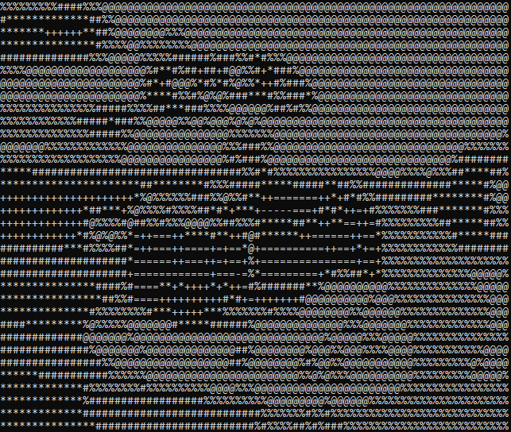
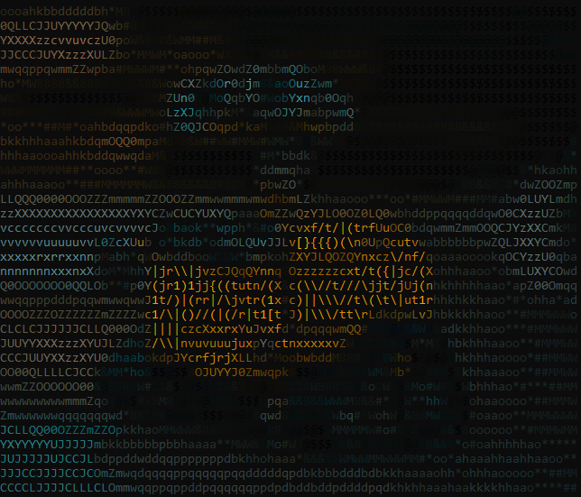

# termflix

Play any image or video directly in your terminal — no browser, no GUI, no compromises.

> **Note:** Screenshots below are best viewed in a terminal with a monospace font.
> For Braille mode, [Windows Terminal](https://aka.ms/terminal) with Cascadia Code is recommended.

---

| Black & White | Color |
|:---:|:---:|
|  |  |

---

## What it does

termflix converts images and videos into terminal-renderable frames using one of three character modes — sparse ASCII for high-contrast B&W output, dense ASCII for smooth color gradients, or Unicode Braille for near-native resolution. Everything runs inside a full TUI player with keyboard controls, a movie browser, and pre-bundled films ready to play on first launch.

---

## Installation

```bash
pip install termflix
```

Requires Python 3.11 or higher. Works on Windows, Linux, and macOS.

---

## Usage

```bash
# Play a bundled movie
termflix play

# Play your own file
termflix play movie.mp4

# Convert and display an image
termflix image photo.jpg --mode braille --color

# Launch the TUI browser
termflix
```

---

## Render modes

| Mode | Flag | Characters | Best for |
|---|---|---|---|
| ASCII 10 | `--mode ascii10` | `@%#*+=-:. ` | B&W, high contrast |
| ASCII 70 | `--mode ascii70` | 70-char gradient set | Color, smooth gradients |
| Braille | `--mode braille` | Unicode U+2800–U+28FF | Maximum resolution |

Each mode supports both B&W and full ANSI truecolor output via `--color`.

---

## Features

- Three character rendering modes — ASCII 10, ASCII 70, and Unicode Braille
- Full ANSI truecolor support — 16 million colors, per-pixel accurate
- Aspect ratio correction for accurate proportions in any terminal
- Full TUI interface — arrow key navigation, keyboard shortcuts, playback controls
- Pre-bundled movies — works out of the box with no extra downloads
- Custom `.termflix` format — portable pre-converted files, compressed and ready to play
- Cross-platform — Windows, Linux, macOS
- pip installable — one command, no dependencies to manage manually

---

## Keyboard controls

| Key | Action |
|---|---|
| `Space` | Play / Pause |
| `←` `→` | Seek backward / forward |
| `↑` `↓` | Volume up / down |
| `m` | Toggle render mode |
| `c` | Toggle color |
| `q` | Quit |

---

## Built with

| Library | Purpose |
|---|---|
| [Textual](https://github.com/Textualize/textual) | TUI framework |
| [Rich](https://github.com/Textualize/rich) | Terminal styling |
| [OpenCV](https://opencv.org/) | Video frame extraction |
| [Pillow](https://python-pillow.org/) | Image processing |
| [NumPy](https://numpy.org/) | Pixel array operations |
| [Click](https://click.palletsprojects.com/) | CLI interface |

---

## Contributing

Contributions are welcome. Please read [`docs/contributing.md`](docs/contributing.md) before opening a pull request. All PRs run through CI automatically — tests and linting must pass.

---

## License

MIT — see [`LICENSE`](LICENSE) for details.